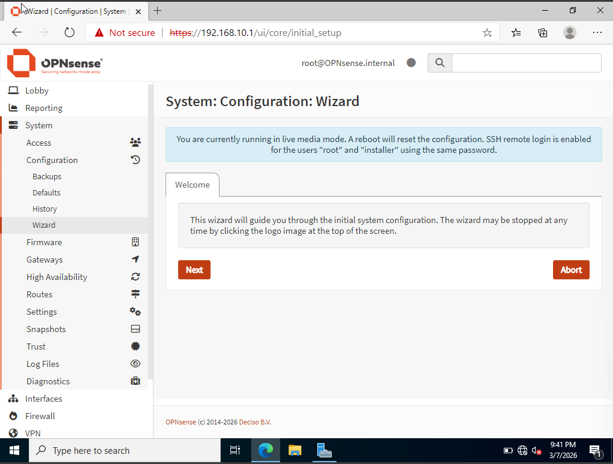
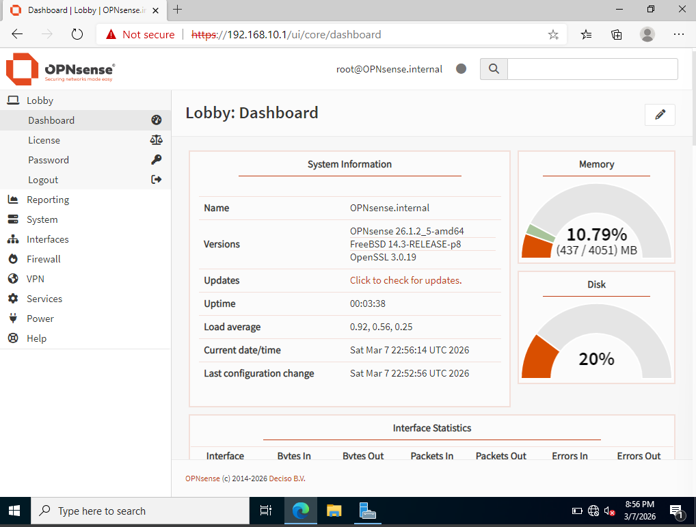
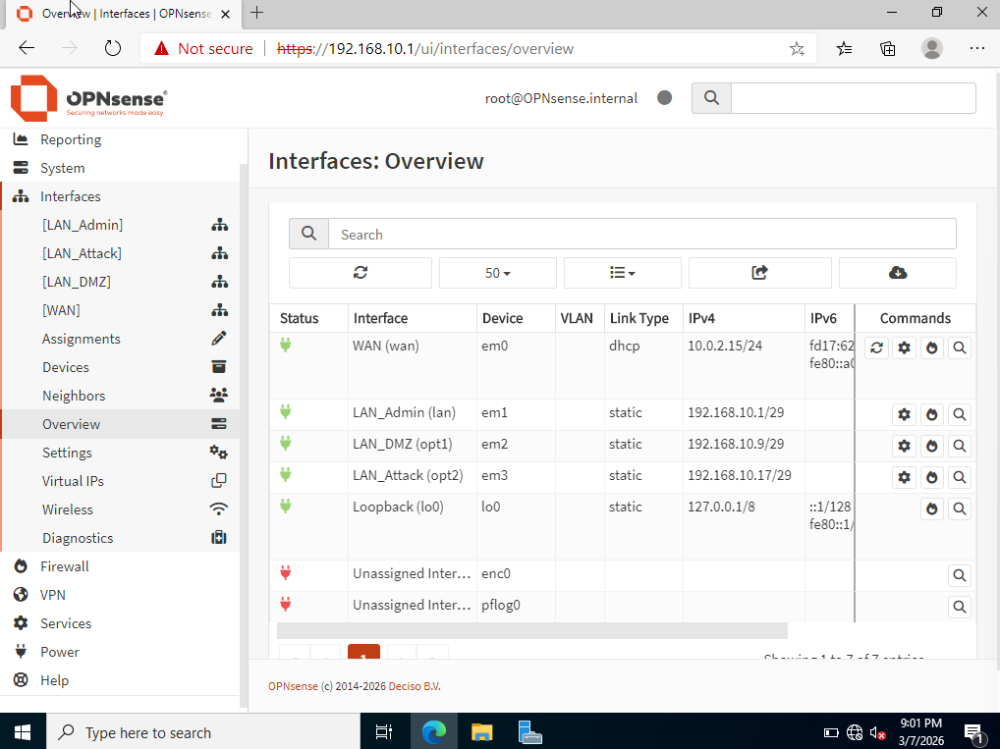
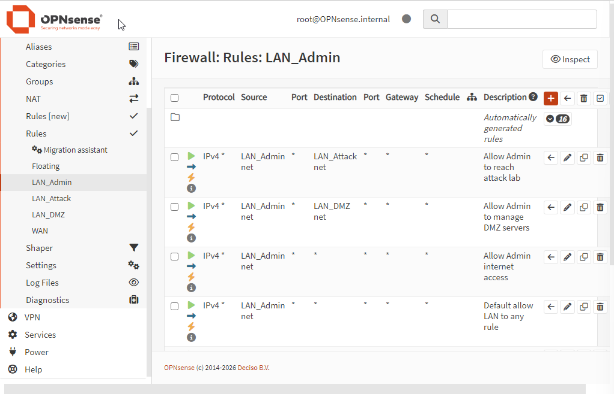
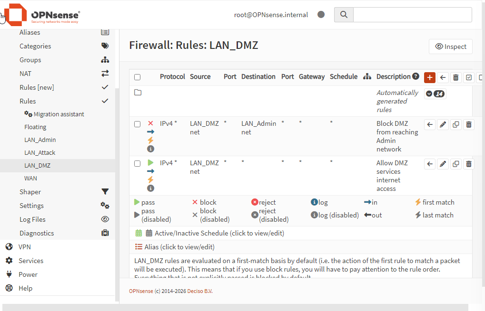
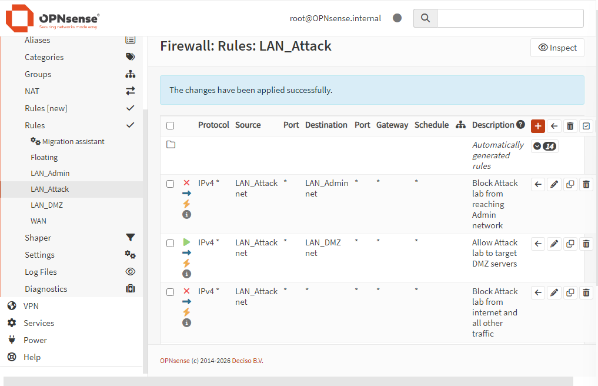
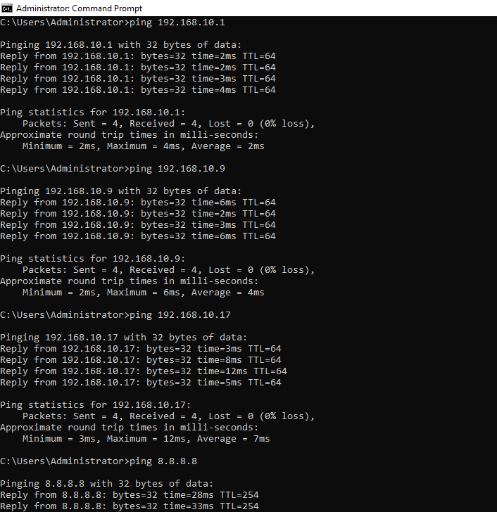
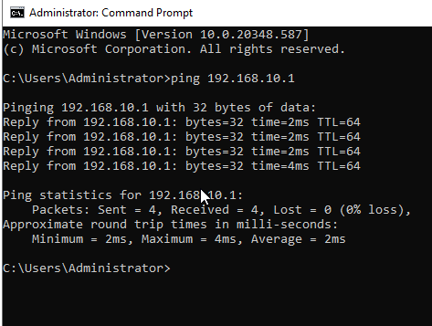

# Entry 002 — OPNsense Installation, Interface Configuration & Firewall Rules

**Date:** 2026-03-07
**Status:** ✅ Complete
**Phase:** Phase 1 — Foundation

---

## What Was Accomplished

- Configured VirtualBox network adapters for all six VMs
- Cloned WinServ VM to create dedicated DNS Server for LAN_DMZ
- Discovered OPNsense was booting from ISO in live media mode — config was not persisting
- Ran OPNsense installer from live session to write permanently to VDI
- Fixed VirtualBox boot order — Hard Disk above Optical, ISO unmounted
- Assigned all four interfaces: WAN, LAN, OPT1, OPT2
- Set static gateway IPs on LAN, OPT1, OPT2
- Accessed OPNsense web GUI from WinServ at https://192.168.10.1
- Renamed interfaces: LAN → LAN_Admin, OPT1 → LAN_DMZ, OPT2 → LAN_Attack
- Applied all firewall rules across three interfaces
- Verified full connectivity from LAN_Admin
- Changed root password from default (security hardening)

---

## Lessons Learned — Live Media Mode

OPNsense was booting from the attached ISO instead of the VDI hard disk.
This caused all interface configurations to be wiped on every reboot since
nothing was being written to persistent storage.

**Fix applied:**
```
1. Ran opnsense-installer from console Option 8 (Shell)
2. Selected: Install → UFS → Stripe → ada0
3. Set root password during install
4. Powered off → removed ISO → set Hard Disk first in boot order
5. Rebooted → config now persists permanently
```

> Always use Option 5 (Halt system) to shut OPNsense down cleanly.
> Force-closing the VM can prevent config writes from completing.

---

## VirtualBox Adapter Wiring

| VM | Adapter 1 | Adapter 2 | Adapter 3 | Adapter 4 |
|---|---|---|---|---|
| OPNsense | NAT (WAN) | LAN_Admin | LAN_DMZ | LAN_Attack |
| WinServ (AD) | LAN_Admin | — | — | — |
| DNS Server | LAN_DMZ | — | — | — |
| Ubuntu Desktop | LAN_Admin | — | — | — |
| Kali (Attack) | LAN_Attack | — | — | — |
| Metasploitable 2 | LAN_Attack | — | — | — |

---

## OPNsense Interface Assignment

| Interface | Adapter | Network | IP Assigned |
|---|---|---|---|
| WAN | em0 | NAT | 10.0.2.15/24 (DHCP) |
| LAN_Admin | em1 | LAN_Admin | 192.168.10.1/29 |
| LAN_DMZ | em2 | LAN_DMZ | 192.168.10.9/29 |
| LAN_Attack | em3 | LAN_Attack | 192.168.10.17/29 |

---

## Firewall Rules Applied

### LAN_Admin (3 rules)

| Priority | Source | Destination | Action | Description |
|---|---|---|---|---|
| 1 | LAN_Admin net | LAN_Attack net | ✅ Allow | Allow Admin to reach attack lab |
| 2 | LAN_Admin net | LAN_DMZ net | ✅ Allow | Allow Admin to manage DMZ servers |
| 3 | LAN_Admin net | any | ✅ Allow | Allow Admin internet access |

### LAN_DMZ (2 rules)

| Priority | Source | Destination | Action | Description |
|---|---|---|---|---|
| 1 | LAN_DMZ net | LAN_Admin net | ❌ Block | Block DMZ from reaching Admin network |
| 2 | LAN_DMZ net | any | ✅ Allow | Allow DMZ services internet access |

### LAN_Attack (3 rules)

| Priority | Source | Destination | Action | Description |
|---|---|---|---|---|
| 1 | LAN_Attack net | LAN_Admin net | ❌ Block | Block Attack lab from reaching Admin |
| 2 | LAN_Attack net | LAN_DMZ net | ✅ Allow | Allow Attack lab to target DMZ servers |
| 3 | LAN_Attack net | any | ❌ Block | Block Attack lab from internet |

---

## Configuration Decisions

- **HTTPS kept enabled** — never downgrade management interfaces to plaintext HTTP
- **Self-signed certificate** — acceptable for internal lab, browser warning is expected
- **Root password changed** — default credentials are publicly known, change immediately on any network device
- **IDS not IPS for Suricata** — allows full attack chain observation for learning
- **DHCP disabled on OPNsense interfaces** — Windows Server will handle DHCP per enterprise architecture standards
- **Auto-generated default LAN rule deleted** — every rule should be intentional and documented

---

## Key Concepts Reinforced

- VirtualBox presents adapters to OPNsense as em0, em1, em2, em3 in order
- Live media mode = running from ISO, no persistent storage — always install to disk
- Firewall rules read top-down — first match wins — order is critical
- Block rules must always sit above catch-all Allow rules on the same interface
- Defense in depth — DMZ → Admin blocked at DMZ interface, not just at Admin
- Stateful firewall — return traffic for established connections auto-permitted
- Default credentials on network devices = critical vulnerability, change immediately
- Auto-generated rules should be reviewed and removed if redundant

---

## Connectivity Verification Results

| Test | Source | Destination | Result |
|---|---|---|---|
| Admin → OPNsense gateway | WinServ | 192.168.10.1 | ✅ 0% loss, 2ms avg |
| Admin → DMZ gateway | WinServ | 192.168.10.9 | ✅ 0% loss, 4ms avg |
| Admin → Attack gateway | WinServ | 192.168.10.17 | ✅ 0% loss, 7ms avg |
| Admin → Internet | WinServ | 8.8.8.8 | ✅ Success |

---

## Evidence

| Screenshot | Description |
|---|---|
|  | First GUI access — live media warning visible |
|  | OPNsense dashboard after permanent install |
|  | All four interfaces named and configured |
|  | Three firewall rules on LAN_Admin |
|  | Two firewall rules on LAN_DMZ |
|  | Three firewall rules on LAN_Attack |
|  | All gateway pings successful from WinServ |
|  | Initial WinServ → OPNsense connectivity test |

---

## Next Session

- Boot Kali and verify Block rules (Attack → Admin blocked, Attack → Internet blocked)
- Configure DHCP on Windows Server for LAN_Admin
- Configure DHCP on DNS Server for LAN_DMZ
- Set hostname on OPNsense
- Begin Active Directory setup on WinServ
