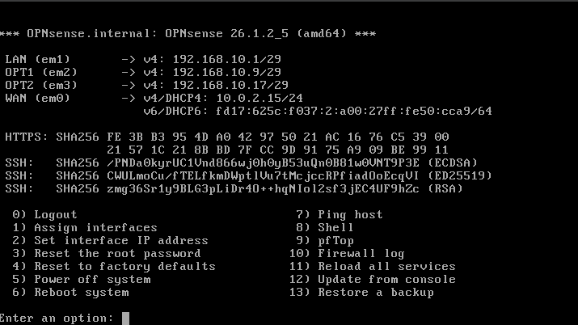

# Entry 002 — OPNsense Interface Configuration

**Date:** 2026-03-07
**Status:** ✅ Complete
**Phase:** Phase 1 — Foundation

---

## What Was Accomplished

- Configured VirtualBox network adapters for all six VMs
- Cloned WinServ VM to create dedicated DNS Server for LAN_DMZ
- Booted OPNsense and completed interface assignment wizard
- Assigned all four interfaces: WAN, LAN, OPT1, OPT2
- Set static gateway IPs on LAN, OPT1, and OPT2
- Confirmed all interfaces active at console

---

## VirtualBox Adapter Wiring

| VM | Adapter 1 | Adapter 2 | Adapter 3 | Adapter 4 |
|---|---|---|---|---|
| OPNsense | NAT (WAN) | LAN_Admin | LAN_DMZ | LAN_Attack |
| WinServ (AD) | LAN_Admin | — | — | — |
| DNS Server | LAN_DMZ | — | — | — |
| Ubuntu Desktop | LAN_Admin | — | — | — |
| Kali (Attack) | LAN_Attack | — | — | — |
| Metasploitable 2 | LAN_Attack | — | — | — |

---

## OPNsense Interface Assignment

| Interface | Adapter | Network | IP Assigned |
|---|---|---|---|
| WAN | em0 | NAT | 10.0.2.15/24 (DHCP) |
| LAN | em1 | LAN_Admin | 192.168.10.1/29 |
| OPT1 | em2 | LAN_DMZ | 192.168.10.9/29 |
| OPT2 | em3 | LAN_Attack | 192.168.10.17/29 |

---

## Configuration Decisions

- **DHCP disabled on all OPNsense interfaces** — DHCP will be handled by Windows Server (LAN_Admin and LAN_DMZ) to follow enterprise architecture standards
- **IPv6 disabled** — IPv4 only lab, no IPv6 required
- **HTTPS kept enabled** — never downgrade management interfaces to plaintext HTTP
- **Self-signed certificate generated** — acceptable for internal lab management; browser will show certificate warning which is expected behavior

---

## Key Concepts Reinforced

- VirtualBox presents adapters to OPNsense as `em0, em1, em2, em3` in order
- WAN is always the NAT adapter — the only interface with upstream gateway
- Internal LAN interfaces have no upstream gateway — OPNsense IS the gateway
- Two DHCP servers on the same subnet causes DHCP conflicts — one server per subnet
- Self-signed certificates encrypt traffic but are not CA-verified — fine for lab use
- HTTPS uses port 443 — always prefer over HTTP (port 80) for management access

---

## Evidence



```
*** OPNsense.internal: OPNsense 26.1.2_5 (amd64) ***

LAN  (em1) → v4: 192.168.10.1/29
OPT1 (em2) → v4: 192.168.10.9/29
OPT2 (em3) → v4: 192.168.10.17/29
WAN  (em0) → v4/DHCP4: 10.0.2.15/24
```

---

## Next Session

- Boot WinServ (AD) and access OPNsense web GUI at `https://192.168.10.1`
- Rename OPT1 → LAN_DMZ and OPT2 → LAN_Attack in web GUI
- Apply all firewall rules per policy table
- Configure DHCP pools on Windows Server
- Run verification ping tests across all segments
