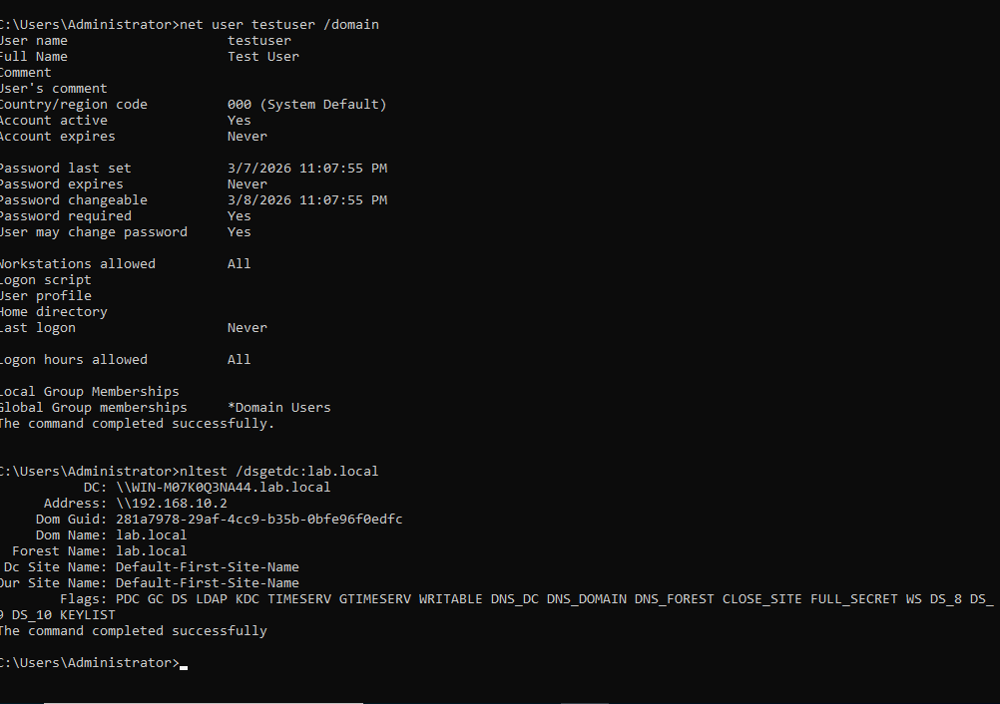
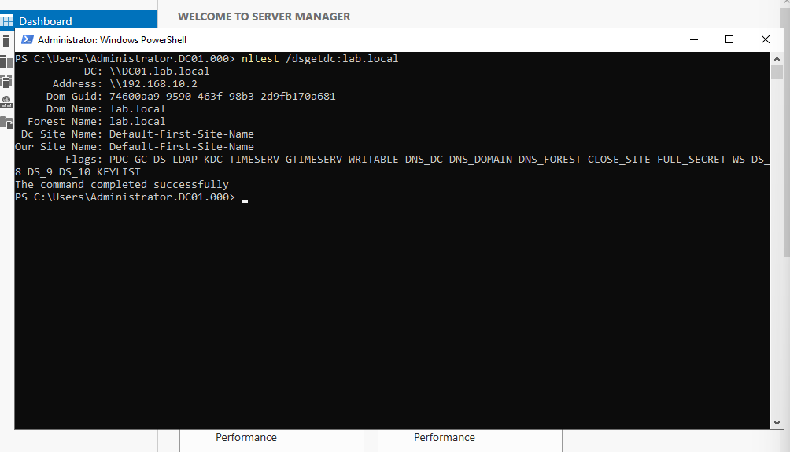

# Entry 004 — Active Directory Installation & DC Configuration

**Date:** 2026-03-21
**Status:** ✅ Complete
**Phase:** Phase 2 — Administration & Monitoring

---

## What Was Accomplished

- Verified WinServ static IP and DNS settings
- Installed Active Directory Domain Services (AD DS) role
- Promoted WinServ to Domain Controller for lab.local
- Configured DNS to point to itself (192.168.10.2)
- Disabled IPv6 on WinServ
- Verified AD with dcdiag and nltest
- Created test domain user (testuser@lab.local)
- Attempted DC rename to DC01 — trust relationship issue encountered

---

## Active Directory Configuration

```
Domain:              lab.local
NetBIOS Name:        LAB
Forest Level:        Windows Server 2016
Domain Level:        Windows Server 2016
Domain Controller:   DC01 (rename in progress)
DC IP:               192.168.10.2
DNS:                 192.168.10.2 (self-hosted)
Fallback DNS:        8.8.8.8
IPv6:                Disabled
```

---

## DNS Configuration — Why DC Points to Itself

```
Before AD promotion:  DNS → 192.168.10.1 (OPNsense)
After AD promotion:   DNS → 192.168.10.2 (itself)
Fallback:             DNS → 8.8.8.8
```

Active Directory installs its own DNS server during promotion.
The DC must point to itself for DNS so that:
- AD SRV records resolve locally and fast
- Kerberos authentication works correctly
- Domain clients can locate the DC via DNS lookup

> Rule: Domain Controllers always point to themselves for DNS first.

---

## Why AD Depends on DNS

Active Directory is built on top of DNS. When a client joins the domain:

```
Client wants to join lab.local
  → DNS lookup: _ldap._tcp.lab.local  (SRV record)
  → DNS returns: 192.168.10.2
  → Client connects to DC
  → Authentication succeeds ✅

Without DNS:
  → SRV lookup fails
  → Client cannot find DC
  → Domain join fails ❌
```

AD automatically registers SRV records during promotion.
These records are how every domain-joined machine finds the DC.

---

## Verification Commands

### dcdiag — Domain Controller Health Check
```cmd
dcdiag > C:\dcdiag-output.txt
```
All tests passed. Minor DNS timeout warnings on external resolvers
are expected — DC was still pointing to OPNsense at time of test.

### nltest — Verify DC Broadcasting
```cmd
nltest /dsgetdc:lab.local
```
Output confirmed:
```
DC:           \\DC01.lab.local
Address:      \\192.168.10.2
Dom Name:     lab.local
Forest Name:  lab.local
Flags:        PDC GC DS LDAP KDC TIMESERV WRITABLE DNS_DC ✅
```

### net user — Verify Test Account
```cmd
net user testuser /domain
```
```
User name:           testuser
Full name:           Test User
Account active:      Yes
Global Group:        *Domain Users
```

---

## Test User Created

| Field | Value |
|---|---|
| Username | testuser |
| UPN | testuser@lab.local |
| Password expires | Never (lab setting) |
| Group | Domain Users |

> Production standard: passwords should always expire and users
> must change at next logon. Never expires is lab convenience only.

---

## DC Rename Issue — ✅ Resolved

Attempted to rename DC from auto-generated name to DC01 via
Windows GUI (System Properties → Computer Name → Change).

**Result:** Domain trust relationship broke after reboot.
```
Error: "The security database on the server does not have
        a computer account for this workstation trust relationship"
```

**Root Cause:** GUI rename on a Domain Controller does not properly
update the AD computer account. The old computer account name
remained in AD while the machine hostname changed — breaking
the secure channel between the machine and the domain.

**Fix Applied:**
```
Step 1 → Booted into DSRM (.\Administrator + DSRM password)
Step 2 → Demoted DC via Server Manager → Remove Roles and Features
Step 3 → Hostname DC01 already set from previous rename attempt
Step 4 → Re-promoted via Server Manager → New Forest → lab.local
Step 5 → Rebooted → LAB\Administrator login successful ✅
```

**Verified with nltest:**
```
DC:           \\DC01.lab.local  ✅
Address:      \\192.168.10.2    ✅
Dom Name:     lab.local         ✅
Forest Name:  lab.local         ✅
Flags:        PDC GC DS LDAP KDC TIMESERV WRITABLE DNS_DC ✅
```

**Lesson learned:** Always rename a server BEFORE promoting to DC,
or use PowerShell Rename-Computer which handles AD account updates:
```powershell
Rename-Computer -NewName "DC01" -DomainCredential LAB\Administrator -Restart
```
Never rename a Domain Controller via the GUI after promotion.

---

## Key Concepts Reinforced

- AD DS role turns Windows Server into a Domain Controller
- DNS is mandatory for AD — clients find DCs via SRV record lookups
- DC must point to itself for DNS after promotion
- dcdiag is the primary tool for verifying DC health
- nltest /dsgetdc verifies the DC is broadcasting on the network
- Principle of least privilege — admin account only for admin tasks
- Never rename a DC via GUI — use PowerShell or rename before promotion
- DSRM password is the emergency recovery credential — never lose it
- PDC, GC, KDC, DNS_DC flags in nltest confirm full DC functionality

---

## OPNsense DNS Updated

After AD DNS was confirmed working:
```
System → Settings → General
Primary DNS:   192.168.10.2  (WinServ AD)
Secondary DNS: 8.8.8.8       (Google fallback)
```

All OPNsense DNS queries now resolve through the AD DNS server first.

---

## Evidence

| Screenshot | Description |
|---|---|
|  | nltest and net user output confirming AD operational |
| [dcdiag-output.txt](evidence/entry-004/dcdiag-output.txt) | Full dcdiag output — all tests passed |
|  | ⚠️ screenshot pending |
|  | nltest confirming DC01.lab.local after trust fix |

---

## Next Session

- Boot into DSRM on WinServ
- Demote DC back to member server
- Rename server to DC01
- Re-promote to Domain Controller
- Verify nltest and dcdiag after rename
- Install Guest Additions on all VMs
- Boot Kali and verify firewall Block rules
