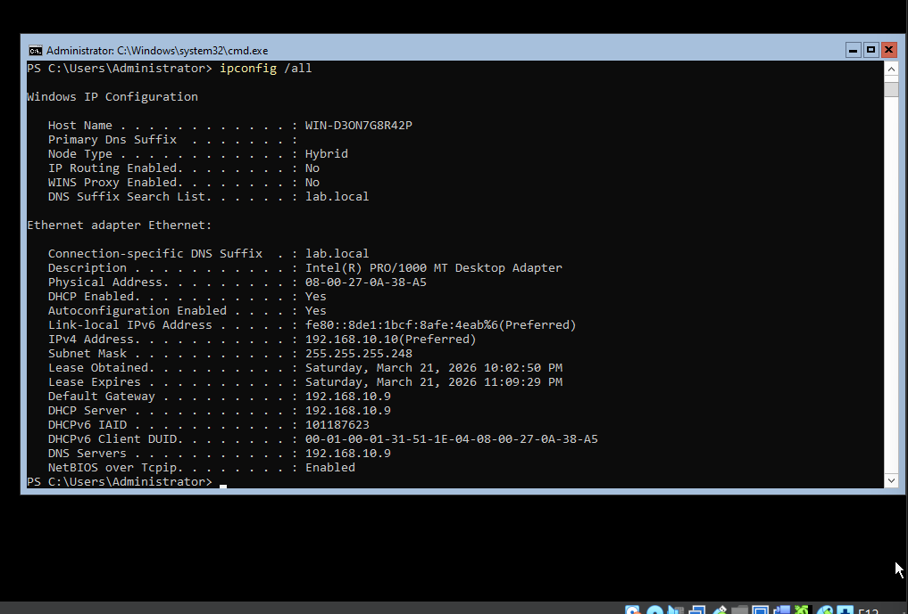
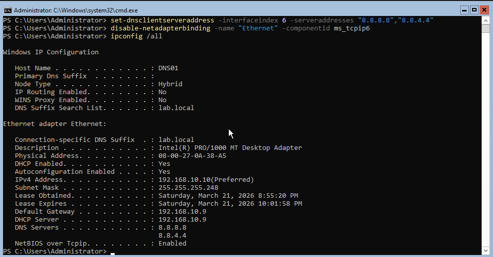
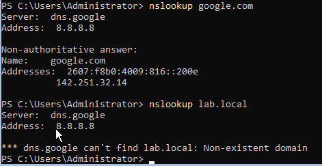
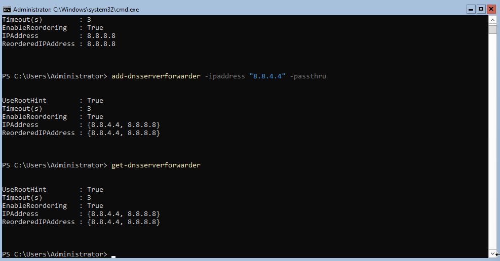
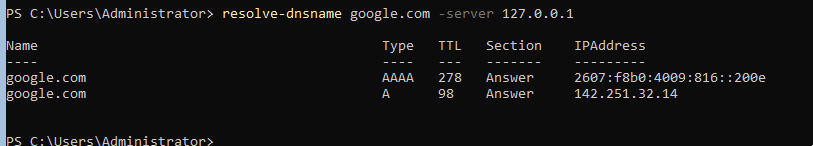

# Entry 005 — Kea DHCP Troubleshooting & DNS01 Configuration

**Date:** 2026-03-21
**Status:** ✅ Complete
**Phase:** Phase 2 — Administration & Monitoring

---

## What Was Accomplished

- Diagnosed and resolved Kea DHCP not serving leases to LAN_DMZ and LAN_Attack
- Identified DHCPRelay conflict with Kea on port 67
- Enabled Kea DHCP with correct interface bindings
- DNS Server VM received static reservation lease (192.168.10.10)
- Renamed DNS Server to DNS01 via PowerShell
- Disabled IPv6 on DNS01
- Configured external DNS (8.8.8.8 / 8.8.4.4)
- Installed Windows DNS Server role
- Configured DNS forwarders to 8.8.8.8 and 8.8.4.4
- Verified external resolution works, lab.local is not resolvable from DMZ

---

## Kea DHCP Troubleshooting

### Problem
DNS Server VM received APIPA address (169.254.x.x) instead of
static reservation 192.168.10.10 — Kea DHCP was not serving leases.

### Root Cause Chain
```
1. Kea DHCP Enable checkbox was not checked in GUI
   → Service configured but never started

2. DHCPRelay was configured and running
   → Competing with Kea for port 67 on all interfaces
   → Error: DHCPSRV_OPEN_SOCKET_FAIL failed to bind to 192.168.10.17:67

3. Kea interfaces-config was empty after reboot
   → GUI not writing interface selection to kea-dhcp4.conf persistently
   → Fix: re-select interfaces in GUI, verify with cat kea-dhcp4.conf
```

### Fix Applied
```
1. Enabled Kea DHCP in Settings tab
2. Selected LAN_Admin, LAN_DMZ, LAN_Attack as listening interfaces
3. Disabled DHCPRelay — no longer needed since Kea binds directly
4. Killed stale dhcrelay process
5. Restarted Kea via: pluginctl -s kea start
6. Verified interfaces in config:
   cat /usr/local/etc/kea/kea-dhcp4.conf | grep -A 5 "interfaces-config"
```

### Key Diagnostic Commands Used
```bash
# Check if Kea is running
ps aux | grep kea-dhcp4

# Check what's using port 67
sockstat -l | grep :67

# View Kea config interfaces
cat /usr/local/etc/kea/kea-dhcp4.conf | grep -A 5 "interfaces-config"

# View Kea logs
tail -20 /var/log/kea/kea-dhcp4.log

# Start/stop Kea
pluginctl -s kea start
pluginctl -s kea stop
```

### Lesson Learned
```
Configured ≠ Running — always verify services are enabled AND running
DHCPRelay and Kea direct binding are mutually exclusive on same interfaces
Use sockstat -l | grep :67 to identify port 67 conflicts
```

---

## Why DHCPRelay Was Not Needed

Initially DHCPRelay was configured because DHCP broadcasts don't
cross router boundaries. However since Kea is configured to listen
directly on all three interfaces (em1, em2, em3), it hears broadcasts
on each segment directly — no relay needed.

```
DHCPRelay needed:    DHCP server on different subnet from clients
                     Server listens on one interface only

DHCPRelay NOT needed: Kea listens directly on all three interfaces
                      em1 (LAN_Admin), em2 (LAN_DMZ), em3 (LAN_Attack)
```

---

## DNS01 Configuration

### Network Settings
```
Hostname:      DNS01
IP Address:    192.168.10.10/29  (Kea static reservation)
Subnet Mask:   255.255.255.248
Gateway:       192.168.10.9
DNS:           8.8.8.8 / 8.8.4.4
IPv6:          Disabled
Mode:          CLI only (no GUI — resource saving)
```

### Rename via PowerShell
```powershell
Rename-Computer -NewName "DNS01" -Restart
```

> Always use PowerShell Rename-Computer — never rename via GUI
> to avoid trust relationship issues (lesson from DC01).

### DNS Server Role Installation
```powershell
Install-WindowsFeature -Name DNS -IncludeManagementTools
```

### DNS Forwarders Configured
```powershell
Add-DnsServerForwarder -IPAddress "8.8.8.8" -PassThru
Add-DnsServerForwarder -IPAddress "8.8.4.4" -PassThru
Get-DnsServerForwarder
```

Output:
```
IPAddress:         {8.8.4.4, 8.8.8.8}
UseRootHint:       True
EnableReordering:  True
```

---

## DNS Architecture — Security Design

```
DC01 (LAN_Admin) 192.168.10.2
  → Authoritative for lab.local
  → Resolves all internal AD names
  → Forwards unknown queries to 8.8.8.8

DNS01 (LAN_DMZ) 192.168.10.10
  → Forward-only, no local zones
  → Forwards ALL queries to 8.8.8.8
  → Cannot resolve lab.local ✅ (intentional)
  → DMZ machines point here for DNS
```

### Why DNS01 Cannot Resolve lab.local

```
DMZ machines resolving internal AD names = security risk
If DMZ server is compromised:
  → Attacker cannot enumerate internal domain via DNS
  → lab.local structure stays hidden from DMZ segment
  → Defense in depth principle applied to DNS
```

### Verification Results
```
nslookup google.com  → 142.251.32.14  ✅  external resolution works
nslookup lab.local   → Non-existent domain ✅  internal AD invisible
Resolve-DnsName google.com -Server 127.0.0.1 → 142.251.32.14 ✅
```

---

## Key Concepts Reinforced

- Configured ≠ Running — always verify services are active after setup
- DHCP broadcasts do not cross router boundaries without a relay
- Kea direct interface binding eliminates need for DHCPRelay
- sockstat -l is the go-to command for port conflict diagnosis
- DHCPRelay and Kea direct binding conflict on port 67
- CLI-only Windows Server saves RAM/CPU — valuable for low-resource VMs
- DNS segmentation — DMZ DNS should never resolve internal AD names
- Forward-only DNS servers forward all queries upstream
- PowerShell Rename-Computer is the safe way to rename any server
- Static DHCP reservations are reliable but production standard is
  static IP configured directly on the adapter

---

## Kea DHCP — Final State

```
Status:      Running ✅
Interfaces:  em1 (LAN_Admin), em2 (LAN_DMZ), em3 (LAN_Attack)
Socket Type: Raw
DHCPRelay:   Disabled (conflict with Kea direct binding)

Active Subnets:
  192.168.10.0/29  LAN_Admin   pool: .2–.6
  192.168.10.8/29  LAN_DMZ     pool: .10–.14
  192.168.10.16/29 LAN_Attack  pool: .18–.22

Static Reservations:
  DC01   08:00:27:FC:A3:D4 → 192.168.10.2
  Ubuntu 08:00:27:2C:AD:09 → 192.168.10.3
  DNS01  08:00:27:0A:38:A5 → 192.168.10.10
  Kali   08:00:27:9A:94:17 → 192.168.10.18
  Meta   08:00:27:96:BE:B1 → 192.168.10.19
```

---

## Evidence

| Screenshot | Description |
|---|---|
|  | DNS01 receiving correct lease from Kea |
|  | DNS01 network config after rename and DNS setup |
|  | google.com resolves, lab.local fails — security boundary confirmed |
|  | DNS forwarders configured to 8.8.8.8 and 8.8.4.4 |
|  | Resolve-DnsName via local DNS service confirming forwarder works |

---

## Next Session

- Boot Kali and verify firewall Block rules
- Install Guest Additions on DC01 and DNS01
- Install Ubuntu Server as web host in LAN_DMZ
- Begin Wazuh SIEM installation on Ubuntu Desktop
