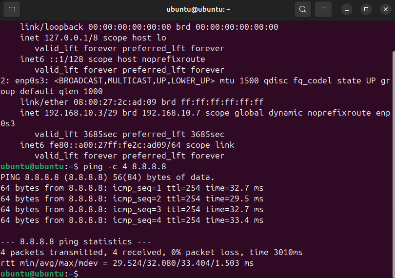
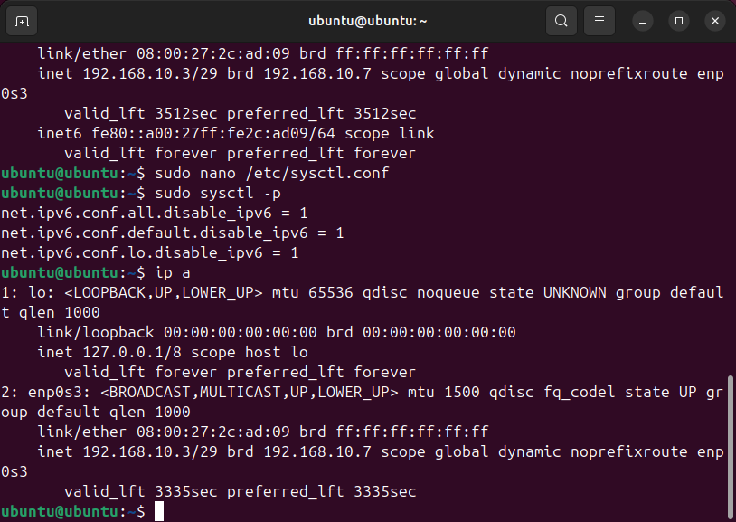
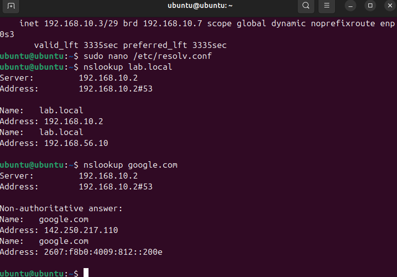
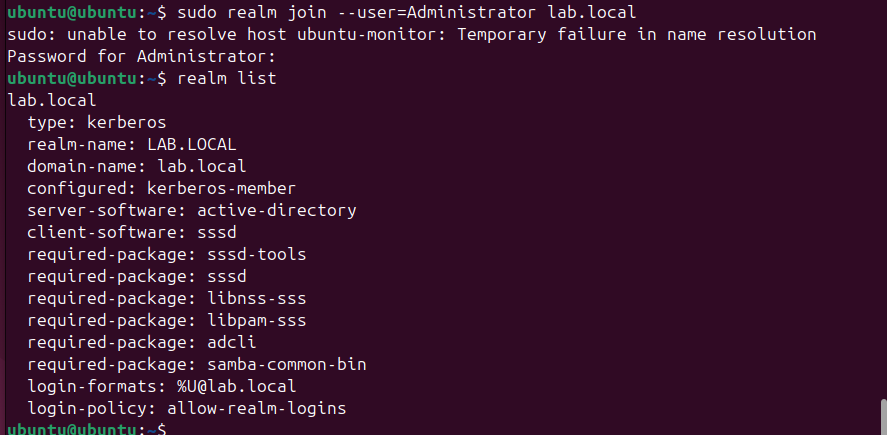
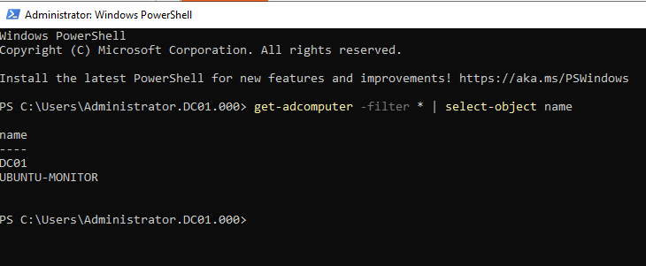
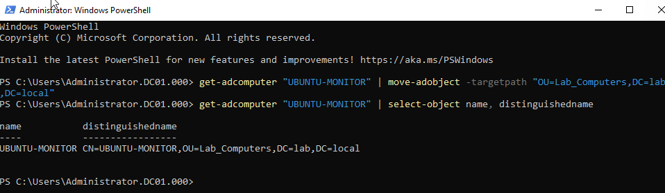

# Entry 006 — Ubuntu Monitor Setup & Domain Join

**Date:** 2026-03-25
**Status:** ✅ Complete
**Phase:** Phase 2 — Administration & Monitoring

---

## What Was Accomplished

- Installed Ubuntu 24.04 on ubuntu-monitor VM
- Configured static IP via Kea DHCP reservation (192.168.10.3)
- Set hostname to ubuntu-monitor
- Disabled IPv6 via sysctl.conf
- Configured DNS to point to DC01 (192.168.10.2)
- Verified internal (lab.local) and external (google.com) DNS resolution
- Installed realm, sssd, adcli and required packages
- Discovered and joined lab.local domain via realm join
- Fixed hostname resolution warning in /etc/hosts
- Verified computer account created in Active Directory
- Moved UBUNTU-MONITOR computer account to Lab_Computers OU

---

## Network Configuration

```
Hostname:     ubuntu-monitor.lab.local
IP Address:   192.168.10.3/29  (Kea static reservation)
Gateway:      192.168.10.1
DNS:          192.168.10.2  (DC01 — internal AD DNS)
IPv6:         Disabled
Domain:       lab.local
```

### IPv6 Disabled via sysctl.conf
```bash
# /etc/sysctl.conf — uncommented these lines:
net.ipv6.conf.all.disable_ipv6 = 1
net.ipv6.conf.default.disable_ipv6 = 1
net.ipv6.conf.lo.disable_ipv6 = 1

# Applied with:
sudo sysctl -p
```

### DNS Configuration
```bash
# /etc/resolv.conf
nameserver 192.168.10.2
search lab.local
```

### Hostname Resolution Fix
```bash
# /etc/hosts — added:
127.0.1.1    ubuntu-monitor.lab.local    ubuntu-monitor
```

> Fixes "unable to resolve host" warning when using sudo.
> /etc/hosts takes priority over DNS for local hostname resolution.

---

## DNS Verification

```bash
nslookup lab.local    → 192.168.10.2  ✅  internal AD resolving
nslookup google.com   → 142.250.217.110 ✅  external resolving via DC01 forwarder
```

---

## Domain Join Process

### Packages Installed
```bash
sudo apt install -y realmd sssd sssd-tools adcli
sudo apt install -y libnss-sss libpam-sss samba-common-bin
```

### Domain Discovery
```bash
realm discover lab.local
```
Output confirmed:
```
lab.local
  type:            kerberos
  realm-name:      LAB.LOCAL
  domain-name:     lab.local
  configured:      no
  server-software: active-directory
  client-software: sssd
```

### Domain Join
```bash
sudo realm join --user=Administrator lab.local
```
No output = success (standard behavior for realm join)

### Verification
```bash
realm list
```
Output confirmed:
```
lab.local
  type:       kerberos
  realm-name: LAB.LOCAL
  configured: kerberos-member  ✅
```

---

## Active Directory Verification

### Computer Account Created on DC01
```powershell
Get-ADComputer -Filter * | Select-Object Name
```
Output:
```
Name
----
DC01
UBUNTU-MONITOR  ✅
```

### Computer Account Moved to Lab_Computers OU
```powershell
Get-ADComputer "UBUNTU-MONITOR" | Move-ADObject -TargetPath "OU=Lab_Computers,DC=lab,DC=local"

# Verified with:
Get-ADComputer "UBUNTU-MONITOR" | Select-Object Name, DistinguishedName
```
Output:
```
CN=UBUNTU-MONITOR,OU=Lab_Computers,DC=lab,DC=local  ✅
```

---

## Key Concepts Reinforced

- realm join is the modern Linux method for joining AD domains
- sssd (System Security Services Daemon) handles AD authentication on Linux
- No output from realm join = success — check with realm list to verify
- /etc/hosts takes priority over DNS for local hostname resolution
- Computer accounts are created in default Computers container on join
- Always move computer accounts to correct OU after domain join
- Mixed Windows/Linux AD environments are standard in enterprise
- sysctl.conf changes require either sysctl -p or reboot to take effect
- Commented lines in config files (#) are ignored — always verify changes saved correctly
- Ubuntu on LAN_Admin uses DC01 DNS — can resolve lab.local internal names
- This differs from DNS01 in DMZ which intentionally cannot resolve lab.local

---

## AD Structure — Current State

```
lab.local
├── Domain Controllers
│   └── DC01
├── Lab_Computers
│   └── UBUNTU-MONITOR  ✅
├── Lab_Servers
│   └── (empty — DNS01 not domain joined, DMZ isolation)
└── Lab_Users
    └── testuser
```

---

## Evidence

| Screenshot | Description |
|---|---|
|  | Internet connectivity verified |
|  | IPv6 disabled via sysctl |
|  | lab.local and google.com resolving correctly |
|  | realm list confirming kerberos-member status |
|  | DC01 showing UBUNTU-MONITOR in AD |
|  | Computer account in Lab_Computers OU |

---

## Next Session

- Install Wazuh SIEM on ubuntu-monitor
- Boot Kali and verify firewall Block rules
- Install Guest Additions on DC01 and ubuntu-monitor
- Install Ubuntu Server as web host in LAN_DMZ
